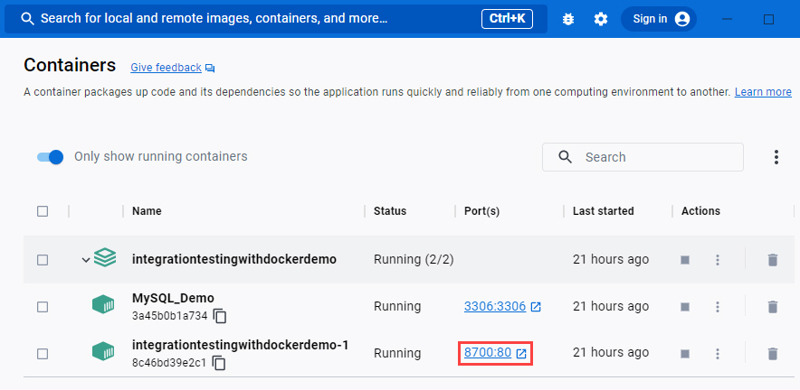
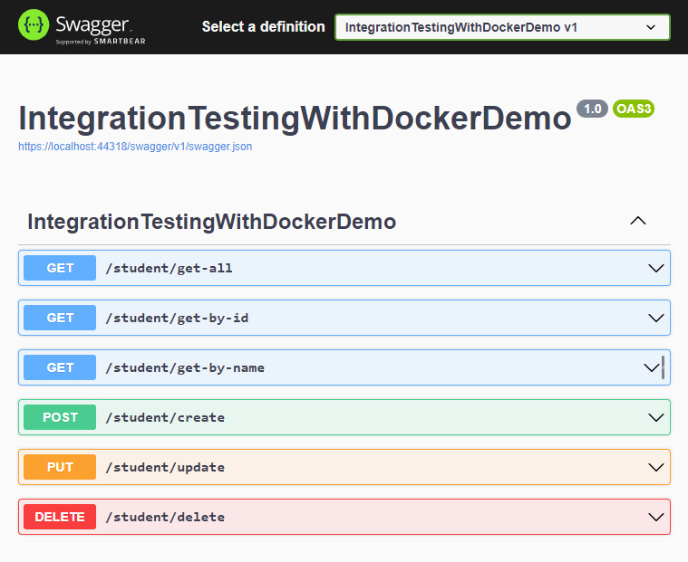
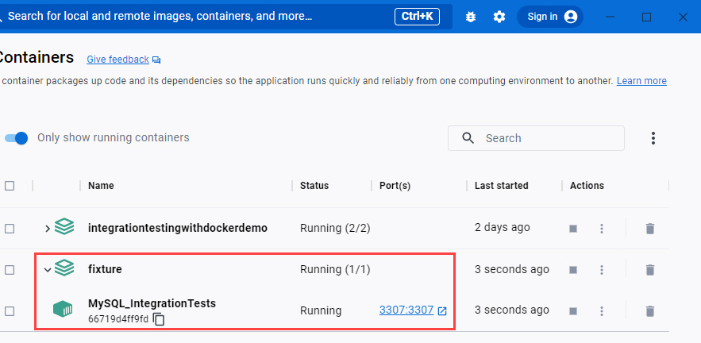
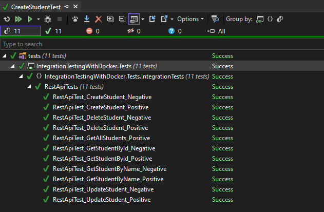

# Integration tests using a real database
Integration tests require you to set up several components that interact with each other, such as running a program and testing various output from it.
The work is often time consuming and requires effort, in my experience, many tend to skip them. The EF in-memory database often behaves differently than relational databases. You should only use the EF in-memory database after fully understanding the issues and trade-offs involved.

Simulating the way the production code would be executed in run-time for doing integration tests can require a great deal of setup,
but there are ways of doing this in an easier way by spinning up an database instance in a docker container at the start of the test run.
That's easy to say, but how? And then I found **[Ductus.FluentDocker](https://mariotoffia.github.io/FluentDocker/)** library as a savior!

# FluentDocker
FluentDocker is a library that enables docker and **docker-compose** interactions using a Fluent API. It is supported on Linux, Windows and Mac. It also has support for the legacy docker-machine interactions.
You can configure, build and run docker images easily using C#.
The library is available at nuget **[Ductus.FluentDocker](https://mariotoffia.github.io/FluentDocker/)** and the [XUnit](https://xunit.net/) test support is available at [Ductus.FluentDocker.XUnit](https://www.nuget.org/packages/Ductus.FluentDocker.XUnit).

# Implementation
This simple demo is based on the use of **[CQRS pattern](https://www.techtarget.com/searchapparchitecture/definition/CQRS-command-query-responsibility-segregation)**, using **[Minimal API(s)](https://learn.microsoft.com/en-us/aspnet/core/fundamentals/minimal-apis/overview?view=aspnetcore-7.0)**, the **[MediatR](https://github.com/jbogard/MediatR)** library, **[MySQL](https://www.mysql.com/)** database and **[Entity Framework Core 7](https://learn.microsoft.com/en-us/ef/core/what-is-new/ef-core-7.0/whatsnew)** as an ORM framework.

The demonstration project is nothing special, so I will focus mainly on the implementation of integration tests.
The backbone of the tests are three basic classes: **DockerComposeTestBase**, **MySqlTestBase** and **IntegrationTestBase**.

**DockerComposeTestBase** is used to orchestrate Docker Host and container(s):

```sharp
public abstract class DockerComposeTestBase : IDisposable
{
    /// <summary>
    /// Compose service is a tool for defining and running multi-container Docker applications.
    /// https://docs.docker.com/compose/
    /// </summary>
    protected ICompositeService? CompositeService;
    protected IHostService? DockerHost;

    protected abstract ICompositeService? Build();

    protected DockerComposeTestBase()
    {
        EnsureDockerHost();

        OnContainerBeforeInitialized();

        CompositeService = Build();
        try
        {
            CompositeService?.Start();
        }
        catch
        {
            CompositeService?.Dispose();
            throw;
        }

        OnContainerInitialized();
    }

    public void Dispose()
    {
        OnContainerTearDown();

        var service = CompositeService;
        CompositeService = null;
        try
        {
            service?.Dispose();
        }
        catch
        {
            // Ignore
        }
    }

    /// <summary>
    ///   Invoked just before the container is initialized.
    /// </summary>
    protected virtual void OnContainerBeforeInitialized()
    {
    }

    /// <summary>
    ///   Invoked just before the container is teared down.
    /// </summary>
    protected virtual void OnContainerTearDown()
    {
    }

    /// <summary>
    ///   Invoked after a container has been created and started.
    /// </summary>
    protected virtual void OnContainerInitialized()
    {
    }

    /// <summary>
    /// Ensure that Docker host is up and running
    /// </summary>
    private void EnsureDockerHost()
    {
        if (DockerHost?.State == ServiceRunningState.Running)
        {
            return;
        }

        IList<IHostService>? hosts = new Hosts().Discover();
        DockerHost = hosts.FirstOrDefault(x => x.IsNative) ?? hosts.FirstOrDefault(x => x.Name == "default");
        if (DockerHost != null)
        {
            if (DockerHost.State != ServiceRunningState.Running)
            {
                DockerHost.Start();
            }
            return;
        }

        if (hosts.Any())
        {
            DockerHost = hosts.First();
        }
    }
}
```
**MySqlTestBase** is used to compose and spin up Docker container with MySQL instance:
```sharp
/// <summary>
/// Base class to compose and spin up Docker container with MySQL instance.
/// </summary>
public class MySqlTestBase : DockerComposeTestBase
{
    private ServiceProvider? _serviceProvider;

    public static TestSettings? TestSettings { get; private set; }

    public MySqlDbContext? MySqlDbContext { get; private set; }

    protected override ICompositeService Build()
    {
        string composeFile = DockerComposeFileFullPath();

        // Configure & compose Docker composite service
        var dockerComposeFileConfig = new DockerComposeFileConfig
        {
            ComposeFilePath = new List<string> { composeFile },
            ForceRecreate = false,
            RemoveOrphans = true,
            StopOnDispose = true,
        };
        return new DockerComposeCompositeService(DockerHost, dockerComposeFileConfig);
    }

    protected virtual string DockerComposeFileFullPath()
    {
        throw new NotImplementedException();
    }

    protected override void OnContainerBeforeInitialized()
    {
        _serviceProvider = CreateServiceProvider();
        TestSettings = _serviceProvider.GetService<IOptions<TestSettings>>()?.Value;
    }

    protected override void OnContainerInitialized()
    {
        var connectionString = BuildMySqlConnectionString();
        WaitForDatabaseIsReady(connectionString);
        MySqlDbContext = new MySqlDbContext(CreateDbContextOptions(connectionString));
        MySqlDbContext.Database.Migrate();
    }

    protected override void OnContainerTearDown()
    {
        _serviceProvider = null;
        MySqlDbContext = null;
        TestSettings = null;
    }

    protected virtual string TestSettingsFileFullPath()
    {
        throw new NotImplementedException();
    }

    private DbContextOptions<MySqlDbContext> CreateDbContextOptions(string connectionString)
    {
        var builder = new DbContextOptionsBuilder<MySqlDbContext>();
        builder.UseMySql(connectionString, ServerVersion.AutoDetect(connectionString), opt =>
        {
            opt.CommandTimeout((int)TimeSpan.FromSeconds(120).TotalSeconds);
            opt.EnableRetryOnFailure(3, TimeSpan.FromSeconds(30), null);
        }).UseInternalServiceProvider(_serviceProvider);

        return builder.Options;
    }

    private static void WaitForDatabaseIsReady(string connectionString)
    {
        using DbConnection connection = new MySqlConnection(connectionString);
        CancellationTokenSource cancellationTokenSource = new CancellationTokenSource();
        cancellationTokenSource.CancelAfter(new TimeSpan(0, 0, 2, 0));
        while (connection.State != System.Data.ConnectionState.Open)
        {
            Policy.Handle<MySqlException>()
                .WaitAndRetryAsync(new[]
                {
                    TimeSpan.FromSeconds(10),
                    TimeSpan.FromSeconds(15),
                    TimeSpan.FromSeconds(20)
                })
                .ExecuteAsync(connection.OpenAsync);

            if (cancellationTokenSource.IsCancellationRequested)
            {
                break;
            }
        }
        if (connection.State == System.Data.ConnectionState.Open)
        {
            connection.Close();
        }
        cancellationTokenSource.Dispose();
    }

    private string BuildMySqlConnectionString()
    {
        IPEndPoint? endPoint = CompositeService?.Containers.FirstOrDefault().ToHostExposedEndpoint(TestSettings?.MySqlPortAndProto);
        if (endPoint == null)
        {
            throw new ApplicationException($"Exposed endpoint is null ({TestSettings?.MySqlPortAndProto})");
        }

        var builder = new MySqlConnectionStringBuilder
        {
            Server = endPoint.Address.ToString(),
            Port = (uint)endPoint.Port,
            Database = TestSettings?.MySqlDatabase,
            UserID = TestSettings?.MySqlUser,
            Password = TestSettings?.MySqlPassword,
            PersistSecurityInfo = false,
            MaximumPoolSize = 5,
            MinimumPoolSize = 0,
            ConnectionTimeout = 20,
            ConnectionLifeTime = 300 // 5 minutes
        };
        return builder.ConnectionString;
    }

    private ServiceProvider CreateServiceProvider()
    {
        IServiceCollection? serviceCollection = new ServiceCollection();
        IConfigurationRoot configuration = new ConfigurationBuilder()
            .SetBasePath(Directory.GetCurrentDirectory())
            .AddJsonFile(
                path: TestSettingsFileFullPath(),
                optional: false,
                reloadOnChange: true)
            .Build();

        serviceCollection.AddOptions();
        serviceCollection.AddEntityFrameworkMySql();
        serviceCollection.AddSingleton<IConfiguration>(configuration);
        serviceCollection.Configure<TestSettings>(configuration.GetSection("TestSettings"));

        return serviceCollection.BuildServiceProvider();
    }
}
```
**IntegrationTestBase** is used to create HttpClient, repositories, locate test-settings and docker-compose files:
```sharp
/// <summary>
/// Base class for creating HttpClient and repositories.
/// </summary>
public class IntegrationTestBase : MySqlTestBase
{
    private WebApplicationFactory<Program>? _application;

    public HttpClient HttpClient { get; private set; }

    public RestApiService RestApiService { get; private set; }

    public StudentsRepository StudentsRepository { get; private set; }

    protected override string DockerComposeFileFullPath()
    {
        string composeFile = Path.Combine(Directory.GetCurrentDirectory(), @"Fixture\docker-compose.yml");
        if (!File.Exists(composeFile))
        {
            throw new FileNotFoundException($"docker-compose file {composeFile} not found.");
        }
        return composeFile;
    }

    protected override string TestSettingsFileFullPath()
    {
        string settingsFile = Path.Combine(Directory.GetCurrentDirectory(), @"Fixture\test-settings.json");
        if (!File.Exists(settingsFile))
        {
            throw new FileNotFoundException($"Settings file {settingsFile} not found.");
        }
        return settingsFile;
    }

    protected override void OnContainerInitialized()
    {
        base.OnContainerInitialized();
        StudentsRepository = new StudentsRepository(MySqlDbContext);
        _application = new WebApplicationFactory<Program>()
            .WithWebHostBuilder(builder => 
                builder.ConfigureServices(services =>
                    services.AddScoped<IStudentsRepository>(_ => StudentsRepository)));
        HttpClient = _application.CreateClient();
        RestApiService = new RestApiService(HttpClient);
        SeetData();
    }

    protected override void OnContainerTearDown()
    {
        base.OnContainerTearDown();
        StudentsRepository = null;
        _application?.Dispose();
    }

    protected void SeetData()
    {
        if (MySqlDbContext?.Students != null && !MySqlDbContext.Students.Any())
        {
            MySqlDbContext.Students.AddRange(GetPreconfiguredStudents());
            MySqlDbContext.SaveChanges();
        }
    }

    // Demo dataset
    private static IEnumerable<Student> GetPreconfiguredStudents()
    {
        return new List<Student>()
        {
            new Student("Tonny Blatt", "Str. 1c", "tony@gmail.com", new DateTime(1991, 10, 7)),
            new Student("Anitta Goldman", "Str. 2c", "Anita@gmail.com", new DateTime(1975, 5, 31)),
            new Student("Alan Ford", "Str. 3c", "alan@gmail.com", new DateTime(2000, 8, 26)),
            new Student("Jim Beam", "Str. 4c", "jim@gmail.com", new DateTime(1984, 1, 12)),
            new Student("Suzanne White", "Str. 5c", "suzanne@gmail.com", new DateTime(1992, 3, 10)),
        };
    }
}
```
**Docker-compose.yml** contains definition for hosted MySql databse instance:
```yml
version: '3.9'

services:
  mysql_integration_tests:
    image: mysql
    container_name: MySQL_IntegrationTests
    restart: always
    environment:
      - MYSQL_DATABASE=IntegrationTesting
      - MYSQL_USER=admin
      - MYSQL_PASSWORD=admin
      - MYSQL_ROOT_PASSWORD=admin
      - MYSQL_TCP_PORT=3307
    ports:
      - 3307:3307
    expose:
      - 3307
    volumes:
      - mysql_integration_tests:/var/lib/mysql
    labels:
      org.label-schema.group: "Database"
    healthcheck:
      test: mysqladmin ping -h 127.0.0.1 -u $$MYSQL_USER --password=$$MYSQL_PASSWORD
      interval: 5s
      timeout: 10s
      retries: 5

volumes:
    mysql_integration_tests:
      driver: local

```
# Run the solution from Docker

To execute compose file, open Powershell, and navigate to the compose file in the solution's root folder.
Then execute the following command: **docker-compose up -d --build --remove-orphans**. To check all running Containers use **docker ps**.





# Running integration tests

When we start **RestApiTests**, a new container **MySQL_IntegrationTests** is created with MySql instance listening on port 3307:


All tests run successfully...



And after running the tests, the **MySQL_IntegrationTests** container is stopped and completely disposed with all assigned volumes too. Nice!

# Trade-offs
Most of the time is spent creating and disposing the container, that’s the trade off when considering other options.
Adding more tests will not be a problem, they fly when the host is ready.

# Summary
[Ductus.FluentDocker](https://mariotoffia.github.io/FluentDocker/) is a small but powerful library. Scenarios and use cases are endless, what's great is that you can do everything in .Net 
so you won't need anything else. Less dependencies, less technologies used. I think you already started imagining how you can integrate that in your workflow!

Enjoy!

- [Visual Studio](https://www.visualstudio.com/vs/community) 2022 17.5 or greater
- [.NET SDK 7.0](https://dotnet.microsoft.com/en-us/download/dotnet/7.0)

## Tags & Technologies
- [.NET 7.0](https://github.com/dotnet/core/blob/main/release-notes/7.0/7.0.3/7.0.3.md)
- [Entity Framework Core 7.x](https://learn.microsoft.com/en-us/ef/core/what-is-new/ef-core-7.0/whatsnew)
- [ASP.NET Core 7.0](https://learn.microsoft.com/en-us/aspnet/core/release-notes/aspnetcore-7.0?view=aspnetcore-7.0)
- [MySQL](https://www.mysql.com/)
- [MediatR](https://github.com/jbogard/MediatR)
- [Ductus.FluentDocker](https://mariotoffia.github.io/FluentDocker/)
- [Ductus.FluentDocker.XUnit](https://www.nuget.org/packages/Ductus.FluentDocker.XUnit)
- [XUnit](https://xunit.net/)

## Licence
Licenced under [MIT](http://opensource.org/licenses/mit-license.php).
Contact me on [LinkedIn](https://si.linkedin.com/in/matjazbravc).
